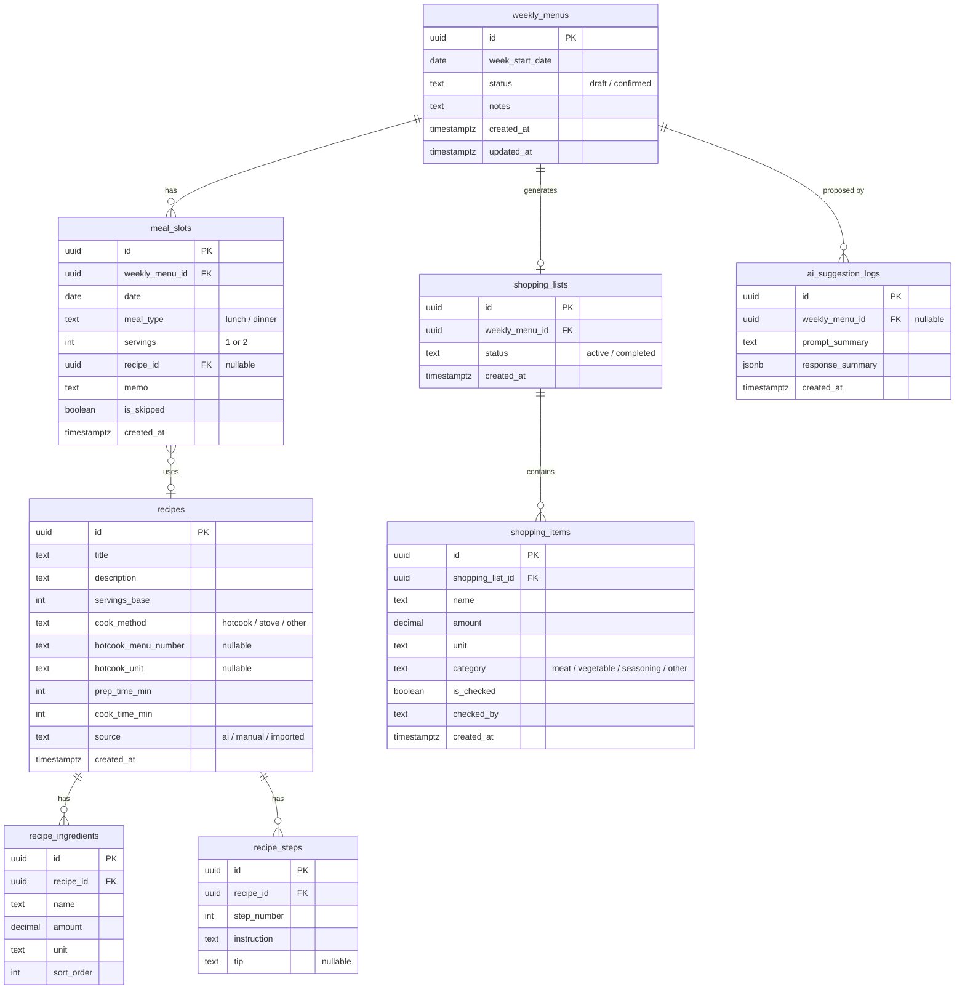

# 献立アプリ DB設計書

## 設計方針

- 家計簿アプリと同じSupabaseプロジェクト内に献立用テーブルを追加
- 認証は既存のSupabase Authを共有
- 全テーブルにRLS（Row Level Security）ポリシーを設定
- MVPでは家計簿テーブルとのFK制約は張らない（Phase 2で連携）

## ER図



## テーブル定義

### 1. weekly_menus（週間献立）

週単位の献立をまとめる親テーブル。

| カラム | 型 | 制約 | 説明 |
|--------|-----|------|------|
| id | uuid | PK, default gen_random_uuid() | |
| week_start_date | date | NOT NULL, UNIQUE | 週の開始日（月曜） |
| status | text | NOT NULL, default 'draft' | `draft` / `confirmed` |
| notes | text | | AI提案時の残り物メモ等 |
| created_at | timestamptz | default now() | |
| updated_at | timestamptz | default now() | |

### 2. meal_slots（食事枠）

「火曜・昼・1人分・カレー」のような1コマを表現。

| カラム | 型 | 制約 | 説明 |
|--------|-----|------|------|
| id | uuid | PK, default gen_random_uuid() | |
| weekly_menu_id | uuid | FK → weekly_menus(id) ON DELETE CASCADE | |
| date | date | NOT NULL | |
| meal_type | text | NOT NULL, CHECK (meal_type IN ('lunch', 'dinner')) | 昼 or 夜のみ |
| servings | int | NOT NULL, default 2 | 1 or 2 |
| recipe_id | uuid | FK → recipes(id) ON DELETE SET NULL, nullable | |
| memo | text | | 「外食に変更」等 |
| is_skipped | boolean | NOT NULL, default false | 外食・不要時にtrue |
| created_at | timestamptz | default now() | |

### 3. recipes（レシピマスタ）

ホットクックレシピを中心に蓄積。

| カラム | 型 | 制約 | 説明 |
|--------|-----|------|------|
| id | uuid | PK, default gen_random_uuid() | |
| title | text | NOT NULL | 「豚こまと大根のべっこう煮」 |
| description | text | | |
| servings_base | int | NOT NULL, default 2 | 基準人数（通常2） |
| cook_method | text | NOT NULL, default 'hotcook' | `hotcook` / `stove` / `other` |
| hotcook_menu_number | text | | ホットクックのNo. |
| hotcook_unit | text | | `まぜ技あり` / `なし` 等 |
| prep_time_min | int | | 下ごしらえ時間 |
| cook_time_min | int | | 加熱時間 |
| source | text | NOT NULL, default 'manual' | `ai` / `manual` / `imported` |
| source_recipe_id | uuid | FK → recipes(id) ON DELETE SET NULL, NULLABLE | AI が殿堂入りレシピをアレンジした場合、参考元のID |
| is_kit | boolean | NOT NULL, default false | ヘルシオデリ等の宅配キット前提フラグ。AI候補から除外 |
| is_favorite | boolean | NOT NULL, default false | 殿堂入り（手動 or avg★4.5 & count≥2） |
| image_url | text | | レシピ画像 |
| created_at | timestamptz | default now() | |

### 4. recipe_ingredients（材料）

| カラム | 型 | 制約 | 説明 |
|--------|-----|------|------|
| id | uuid | PK, default gen_random_uuid() | |
| recipe_id | uuid | FK → recipes(id) ON DELETE CASCADE | |
| name | text | NOT NULL | 「豚こま切れ肉」 |
| amount | decimal | NOT NULL | 200 |
| unit | text | NOT NULL | `g` / `本` / `大さじ` 等 |
| sort_order | int | NOT NULL, default 0 | 表示順 |

### 5. recipe_steps（手順）

| カラム | 型 | 制約 | 説明 |
|--------|-----|------|------|
| id | uuid | PK, default gen_random_uuid() | |
| recipe_id | uuid | FK → recipes(id) ON DELETE CASCADE | |
| step_number | int | NOT NULL | |
| instruction | text | NOT NULL | 「玉ねぎを下に敷く」 |
| tip | text | | コツ・補足 |

### 6. shopping_lists（買い物リスト）

| カラム | 型 | 制約 | 説明 |
|--------|-----|------|------|
| id | uuid | PK, default gen_random_uuid() | |
| weekly_menu_id | uuid | FK → weekly_menus(id) ON DELETE CASCADE, UNIQUE | |
| status | text | NOT NULL, default 'active' | `active` / `completed` |
| created_at | timestamptz | default now() | |

### 7. shopping_items（買い物アイテム）

| カラム | 型 | 制約 | 説明 |
|--------|-----|------|------|
| id | uuid | PK, default gen_random_uuid() | |
| shopping_list_id | uuid | FK → shopping_lists(id) ON DELETE CASCADE | |
| name | text | NOT NULL | 「大根」 |
| amount | decimal | | |
| unit | text | | |
| category | text | default 'other' | `meat` / `vegetable` / `seasoning` / `other` |
| is_checked | boolean | NOT NULL, default false | チェック状態 |
| checked_by | text | | 誰がチェックしたか |
| created_at | timestamptz | default now() | |

### 8. ai_suggestion_logs（AI提案ログ）

| カラム | 型 | 制約 | 説明 |
|--------|-----|------|------|
| id | uuid | PK, default gen_random_uuid() | |
| weekly_menu_id | uuid | FK → weekly_menus(id) ON DELETE SET NULL, nullable | |
| prompt_summary | text | NOT NULL | ユーザー入力の要約 |
| response_summary | jsonb | NOT NULL | AI応答の構造化データ |
| created_at | timestamptz | default now() | |

## CREATE TABLE SQL

```sql
-- ============================================================
-- 献立アプリ テーブル作成
-- ============================================================

-- 1. weekly_menus
CREATE TABLE weekly_menus (
  id uuid PRIMARY KEY DEFAULT gen_random_uuid(),
  week_start_date date NOT NULL UNIQUE,
  status text NOT NULL DEFAULT 'draft' CHECK (status IN ('draft', 'confirmed')),
  notes text,
  created_at timestamptz DEFAULT now(),
  updated_at timestamptz DEFAULT now()
);

-- 2. recipes（meal_slotsより先に作成：FK参照先）
CREATE TABLE recipes (
  id uuid PRIMARY KEY DEFAULT gen_random_uuid(),
  title text NOT NULL,
  description text,
  servings_base int NOT NULL DEFAULT 2,
  cook_method text NOT NULL DEFAULT 'hotcook' CHECK (cook_method IN ('hotcook', 'stove', 'other')),
  hotcook_menu_number text,
  hotcook_unit text,
  prep_time_min int,
  cook_time_min int,
  source text NOT NULL DEFAULT 'manual' CHECK (source IN ('ai', 'manual', 'imported')),
  created_at timestamptz DEFAULT now()
);

-- 3. meal_slots
CREATE TABLE meal_slots (
  id uuid PRIMARY KEY DEFAULT gen_random_uuid(),
  weekly_menu_id uuid NOT NULL REFERENCES weekly_menus(id) ON DELETE CASCADE,
  date date NOT NULL,
  meal_type text NOT NULL CHECK (meal_type IN ('lunch', 'dinner')),
  servings int NOT NULL DEFAULT 2,
  recipe_id uuid REFERENCES recipes(id) ON DELETE SET NULL,
  memo text,
  is_skipped boolean NOT NULL DEFAULT false,
  created_at timestamptz DEFAULT now()
);

-- 4. recipe_ingredients
CREATE TABLE recipe_ingredients (
  id uuid PRIMARY KEY DEFAULT gen_random_uuid(),
  recipe_id uuid NOT NULL REFERENCES recipes(id) ON DELETE CASCADE,
  name text NOT NULL,
  amount decimal NOT NULL,
  unit text NOT NULL,
  sort_order int NOT NULL DEFAULT 0
);

-- 5. recipe_steps
CREATE TABLE recipe_steps (
  id uuid PRIMARY KEY DEFAULT gen_random_uuid(),
  recipe_id uuid NOT NULL REFERENCES recipes(id) ON DELETE CASCADE,
  step_number int NOT NULL,
  instruction text NOT NULL,
  tip text
);

-- 6. shopping_lists
CREATE TABLE shopping_lists (
  id uuid PRIMARY KEY DEFAULT gen_random_uuid(),
  weekly_menu_id uuid NOT NULL UNIQUE REFERENCES weekly_menus(id) ON DELETE CASCADE,
  status text NOT NULL DEFAULT 'active' CHECK (status IN ('active', 'completed')),
  created_at timestamptz DEFAULT now()
);

-- 7. shopping_items
CREATE TABLE shopping_items (
  id uuid PRIMARY KEY DEFAULT gen_random_uuid(),
  shopping_list_id uuid NOT NULL REFERENCES shopping_lists(id) ON DELETE CASCADE,
  name text NOT NULL,
  amount decimal,
  unit text,
  category text DEFAULT 'other' CHECK (category IN ('meat', 'vegetable', 'seasoning', 'other')),
  is_checked boolean NOT NULL DEFAULT false,
  checked_by text,
  created_at timestamptz DEFAULT now()
);

-- 8. ai_suggestion_logs
CREATE TABLE ai_suggestion_logs (
  id uuid PRIMARY KEY DEFAULT gen_random_uuid(),
  weekly_menu_id uuid REFERENCES weekly_menus(id) ON DELETE SET NULL,
  prompt_summary text NOT NULL,
  response_summary jsonb NOT NULL,
  created_at timestamptz DEFAULT now()
);

-- ============================================================
-- インデックス
-- ============================================================

CREATE INDEX idx_meal_slots_weekly_menu ON meal_slots(weekly_menu_id);
CREATE INDEX idx_meal_slots_date ON meal_slots(date);
CREATE INDEX idx_recipe_ingredients_recipe ON recipe_ingredients(recipe_id);
CREATE INDEX idx_recipe_steps_recipe ON recipe_steps(recipe_id);
CREATE INDEX idx_shopping_items_list ON shopping_items(shopping_list_id);
CREATE INDEX idx_ai_logs_weekly_menu ON ai_suggestion_logs(weekly_menu_id);

-- ============================================================
-- Supabase Realtime
-- ============================================================

ALTER PUBLICATION supabase_realtime ADD TABLE shopping_items;

-- ============================================================
-- updated_at 自動更新トリガー（weekly_menus用）
-- ============================================================

CREATE OR REPLACE FUNCTION update_updated_at()
RETURNS TRIGGER AS $$
BEGIN
  NEW.updated_at = now();
  RETURN NEW;
END;
$$ LANGUAGE plpgsql;

CREATE TRIGGER set_updated_at
  BEFORE UPDATE ON weekly_menus
  FOR EACH ROW
  EXECUTE FUNCTION update_updated_at();

-- ============================================================
-- Migration: Gemini生成優先化 (Phase D / 2026-04)
-- ============================================================
-- AI提案をDBレシピ選定型から Gemini 生成型へ格上げするにあたり、
--  1. アレンジ元レシピの紐付け (source_recipe_id)
--  2. 宅配キット系レシピの除外フラグ (is_kit)
-- を追加する。既存環境では以下を Supabase SQL Editor で実行する。

ALTER TABLE recipes
  ADD COLUMN IF NOT EXISTS source_recipe_id uuid
    REFERENCES recipes(id) ON DELETE SET NULL;

ALTER TABLE recipes
  ADD COLUMN IF NOT EXISTS is_kit boolean NOT NULL DEFAULT false;

-- バックフィル: 材料 3 件未満 + source='imported' のレシピを
-- 宅配キット前提としてフラグ付けする（ヘルシオデリ系を AI 候補から除外）
UPDATE recipes SET is_kit = true
WHERE source = 'imported'
  AND id IN (
    SELECT r.id FROM recipes r
    LEFT JOIN recipe_ingredients ri ON ri.recipe_id = r.id
    GROUP BY r.id
    HAVING COUNT(ri.id) < 3
  );
```

## RLSポリシー

全テーブルでRLSを有効化。認証済みユーザーのみアクセス可能。
家計簿アプリと同様、1つのGoogleアカウントで全データにアクセスする運用のため、
`auth.uid()` による行レベルフィルタではなく「認証済みか否か」でゲートする。

```sql
-- ============================================================
-- RLS有効化 + ポリシー
-- ============================================================

-- weekly_menus
ALTER TABLE weekly_menus ENABLE ROW LEVEL SECURITY;
CREATE POLICY "authenticated_access" ON weekly_menus
  FOR ALL USING (auth.role() = 'authenticated')
  WITH CHECK (auth.role() = 'authenticated');

-- meal_slots
ALTER TABLE meal_slots ENABLE ROW LEVEL SECURITY;
CREATE POLICY "authenticated_access" ON meal_slots
  FOR ALL USING (auth.role() = 'authenticated')
  WITH CHECK (auth.role() = 'authenticated');

-- recipes
ALTER TABLE recipes ENABLE ROW LEVEL SECURITY;
CREATE POLICY "authenticated_access" ON recipes
  FOR ALL USING (auth.role() = 'authenticated')
  WITH CHECK (auth.role() = 'authenticated');

-- recipe_ingredients
ALTER TABLE recipe_ingredients ENABLE ROW LEVEL SECURITY;
CREATE POLICY "authenticated_access" ON recipe_ingredients
  FOR ALL USING (auth.role() = 'authenticated')
  WITH CHECK (auth.role() = 'authenticated');

-- recipe_steps
ALTER TABLE recipe_steps ENABLE ROW LEVEL SECURITY;
CREATE POLICY "authenticated_access" ON recipe_steps
  FOR ALL USING (auth.role() = 'authenticated')
  WITH CHECK (auth.role() = 'authenticated');

-- shopping_lists
ALTER TABLE shopping_lists ENABLE ROW LEVEL SECURITY;
CREATE POLICY "authenticated_access" ON shopping_lists
  FOR ALL USING (auth.role() = 'authenticated')
  WITH CHECK (auth.role() = 'authenticated');

-- shopping_items
ALTER TABLE shopping_items ENABLE ROW LEVEL SECURITY;
CREATE POLICY "authenticated_access" ON shopping_items
  FOR ALL USING (auth.role() = 'authenticated')
  WITH CHECK (auth.role() = 'authenticated');

-- ai_suggestion_logs
ALTER TABLE ai_suggestion_logs ENABLE ROW LEVEL SECURITY;
CREATE POLICY "authenticated_access" ON ai_suggestion_logs
  FOR ALL USING (auth.role() = 'authenticated')
  WITH CHECK (auth.role() = 'authenticated');
```

## 食材集約ロジック（買い物リスト生成時）

買い物リスト生成時の食材集約ルール：

- **同一食材名 + 同一単位** → 合算（例：豚こま 200g + 豚こま 150g → 豚こま 350g）
- **同一食材名 + 異なる単位** → 別行表示（例：醤油 大さじ2 と 醤油 50ml は別行）
- 人数（servings）に応じた分量調整：`amount × (slot.servings / recipe.servings_base)`
- `is_skipped = true` のslotは集約対象外

この集約ロジックは `lib/utils/aggregate-ingredients.ts` に集約し、
`POST /api/weekly-menus/[id]/confirm` と `generate_shopping_list` FC の両方から呼び出す。
