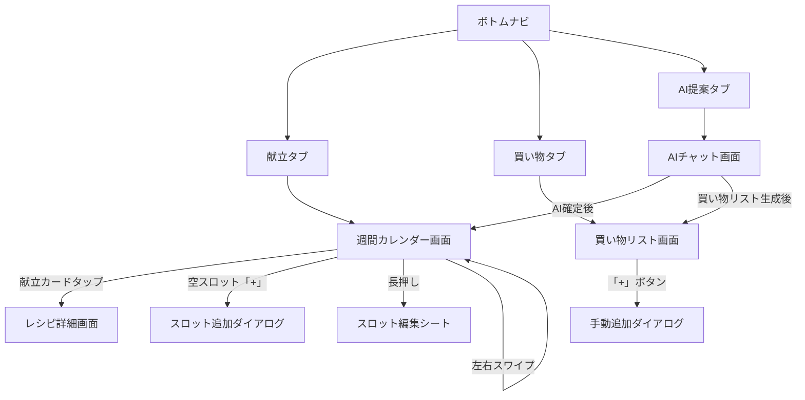

# 献立アプリ 画面設計書

## 設計方針

- 家計簿アプリのUI（Tailwind CSS + Radix UI）と統一感を保つ
- モバイルファースト（れん・あかね共にスマホでの利用が主）
- ボトムナビゲーションで3タブ構成
- 家計簿アプリのカラー体系を踏襲（共同パープル系をベースに、献立アプリ用のアクセントカラー追加）

## 画面構成

### ボトムナビゲーション（3タブ）

| タブ | アイコン | 画面 | 説明 |
|------|---------|------|------|
| 献立 | CalendarDays | 週間献立 | メイン画面。週のカレンダー |
| 買い物 | ShoppingCart | 買い物リスト | チェックリスト |
| AI提案 | Sparkles | AI献立チャット | チャットUI |

## 画面遷移図



## 各画面の詳細

### 1. 週間カレンダー画面（献立タブ・メイン）

アプリを開いた時の最初の画面。

#### レイアウト

```
┌──────────────────────────┐
│  ← 4/7〜4/13 の献立  →   │  ← 週切り替え（スワイプ or 矢印）
├──────────────────────────┤
│ 月 4/7                    │
│ ┌─────────┐┌─────────┐  │
│ │🍱 昼 1人 ││🍲 夜 2人 │  │  ← 献立カード
│ │鶏の照焼  ││肉じゃが  │  │
│ └─────────┘└─────────┘  │
├──────────────────────────┤
│ 火 4/8                    │
│ ┌─────────┐┌─────────┐  │
│ │  ＋ 昼   ││🍲 夜 2人 │  │  ← 空スロット
│ │         ││カレー    │  │
│ └─────────┘└─────────┘  │
├──────────────────────────┤
│ ...                       │
├──────────────────────────┤
│  [献立]  [買い物]  [AI]   │  ← ボトムナビ
└──────────────────────────┘
```

#### 献立カードの要素

- レシピタイトル
- meal_type アイコン（昼: 🍱 / 夜: 🍲）
- 人数バッジ（「1人」「2人」）
- スキップ時はグレーアウト +「外食」等のラベル

#### 操作

| 操作 | アクション |
|------|----------|
| カードタップ | レシピ詳細画面へ遷移 |
| 空スロット「+」タップ | スロット追加ダイアログ |
| カード長押し | 編集ボトムシート表示 |
| 左右スワイプ | 週切り替え |

#### 空状態（献立未登録の週）

- 「この週の献立はまだありません」テキスト
- 「AIに提案してもらう」ボタン → AI提案タブへ遷移
- weekly_menuが存在しない週は空状態を返す（自動作成しない）

### 2. レシピ詳細画面

献立カードタップで表示。あかねさんが調理時に使う画面。

#### レイアウト

```
┌──────────────────────────┐
│  ← 豚こまと大根のべっこう煮 │
├──────────────────────────┤
│  🍳 ホットクック No.085     │
│  まぜ技ユニット：あり       │
│  下ごしらえ 10分 / 加熱 35分│
├──────────────────────────┤
│  2人分（元レシピ: 2人分）   │  ← servingsに応じて分量調整
├──────────────────────────┤
│  ■ 材料                   │
│  豚こま切れ肉 ... 200g     │
│  大根 ............ 1/2本   │
│  醤油 ............ 大さじ2 │
│  ...                       │
├──────────────────────────┤
│  ■ 手順                   │
│  1. 大根を2cm幅に切る      │
│  2. 内鍋に大根を下に敷く    │
│  3. 豚こまを広げてのせる    │
│     💡 肉が重ならないよう   │
│  ...                       │
└──────────────────────────┘
```

#### 要素

- ヘッダー：レシピタイトル + 戻るボタン
- ホットクック情報カード（メニューNo.、まぜ技ユニット、時間）
- 人数表示（meal_slotsのservingsに合わせた分量計算済み）
- 材料リスト（分量はservings比で自動計算）
- 手順リスト（step_number順、tipがあれば💡で表示）

### 3. スロット編集ボトムシート

献立カード長押しで表示されるRadix UIのシート。

#### 要素

| 要素 | 説明 |
|------|------|
| 人数切り替え | 1人 / 2人 セグメントコントロール |
| レシピ変更 | レシピ検索 → 差し替え |
| メモ入力 | テキストフィールド |
| 外食にする | is_skipped = true + memo = "外食" |
| 削除 | meal_slot削除 |

### 4. 買い物リスト画面（買い物タブ）

#### レイアウト

```
┌──────────────────────────┐
│  📋 買い物リスト            │
│  4/7〜4/13 の週            │
├──────────────────────────┤
│  🥩 肉・魚                │
│  ☐ 豚こま切れ肉 ... 400g  │
│  ☑ 鶏もも肉 ..... 300g   │  ← チェック済み（グレー表示）
├──────────────────────────┤
│  🥬 野菜                  │
│  ☐ 大根 ......... 1本     │
│  ☐ 玉ねぎ ....... 2個     │
├──────────────────────────┤
│  🧂 調味料                │
│  ☐ 醤油 ......... 大さじ4 │
│  ☐ 酒 ........... 大さじ2 │
│  ☐ 醤油 ......... 50ml    │  ← 異単位は別行表示
├──────────────────────────┤
│          [＋ 追加]         │
├──────────────────────────┤
│  [献立]  [買い物]  [AI]   │
└──────────────────────────┘
```

#### 要素・操作

| 要素 | 説明 |
|------|------|
| カテゴリ別表示 | meat / vegetable / seasoning / other でグループ化 |
| チェックボックス | タップでis_checked切替。Realtimeで2人同期 |
| checked_by | チェックした人の名前を小さく表示 |
| 「＋ 追加」ボタン | 手動追加ダイアログ |
| 左スワイプ | アイテム削除 |

#### 空状態（買い物リストなし）

- 「献立を確定すると買い物リストが生成されます」テキスト
- 「献立を見る」ボタン → 献立タブへ

#### Supabase Realtime

`shopping_items` テーブルのUPDATE/INSERT/DELETEをsubscribe。
れんがスーパーでチェックすると、あかねの画面にもリアルタイム反映。

### 5. AIチャット画面（AI提案タブ）

#### レイアウト

```
┌──────────────────────────┐
│  🤖 献立を考えよう         │
├──────────────────────────┤
│                           │
│  👤 冷蔵庫に豚こまと大根が │
│     残ってます。今週は：   │
│     月昼1人、月夜2人、    │
│     火昼なし、火夜2人...   │
│                           │
│  🤖 了解！こんな献立は     │
│     どうですか？           │
│     月昼: 豚こま丼(1人)    │
│     月夜: べっこう煮(2人)  │
│     ...                   │
│                           │
│  👤 水曜の夜は外食にして   │
│                           │
│  🤖 了解、水曜夜を外します │
│     修正しました：...      │
│                           │
│  👤 これでOK！確定で       │
│                           │
│  🤖 確定しました！         │
│     買い物リストも作成済み  │
│     → [買い物リストを見る]  │
│                           │
├──────────────────────────┤
│  [メッセージを入力...]  ▶  │
├──────────────────────────┤
│  [献立]  [買い物]  [AI]   │
└──────────────────────────┘
```

#### 要素

| 要素 | 説明 |
|------|------|
| チャット履歴 | ユーザー（右寄せ）/ AI（左寄せ）のバブル |
| 献立提案カード | AI提案時に構造化された献立カードで表示 |
| 確定ボタン | AI応答内に「この献立にする」ボタン |
| テキスト入力 | 下部の入力バー + 送信ボタン |
| ストリーミング | SSEで逐次表示 |

#### AIチャットフロー

1. ユーザーが残り物と予定を入力
2. AI（Gemini）が献立提案 → `propose_weekly_menu` FC発火 → カード表示
3. やり取りを繰り返す（修正依頼 → 再提案）
4. ユーザーが「確定」→ `save_weekly_menu` FC発火 → DB保存
5. 自動で `generate_shopping_list` → 買い物リスト生成
6. 「買い物リストを見る」リンク表示

## Next.js ページ構成

```
src/app/
├── (kondate)/                    # 献立アプリ レイアウトグループ
│   ├── layout.tsx                # ボトムナビ付きレイアウト
│   ├── menu/                     # 献立タブ
│   │   └── page.tsx              # 週間カレンダー画面
│   ├── menu/[recipeId]/          # レシピ詳細
│   │   └── page.tsx
│   ├── shopping/                 # 買い物タブ
│   │   └── page.tsx              # 買い物リスト画面
│   └── ai/                       # AI提案タブ
│       └── page.tsx              # AIチャット画面
```

## コンポーネント設計

```
src/components/kondate/
├── WeeklyCalendar.tsx            # 週間カレンダー（週切り替え対応）
├── MealSlotCard.tsx              # 献立カード（1コマ）
├── EmptySlot.tsx                 # 空スロット（+ボタン）
├── RecipeDetail.tsx              # レシピ詳細表示
├── RecipeIngredientList.tsx      # 材料リスト（分量計算済み）
├── RecipeStepList.tsx            # 手順リスト
├── SlotEditSheet.tsx             # 編集ボトムシート
├── ShoppingList.tsx              # 買い物リスト全体
├── ShoppingItem.tsx              # 買い物アイテム行
├── ShoppingAddDialog.tsx         # 手動追加ダイアログ
├── AiChat.tsx                    # AIチャット画面
├── AiChatBubble.tsx              # チャットバブル
├── MealPlanProposalCard.tsx      # AI献立提案カード
└── BottomNav.tsx                 # ボトムナビゲーション
```
